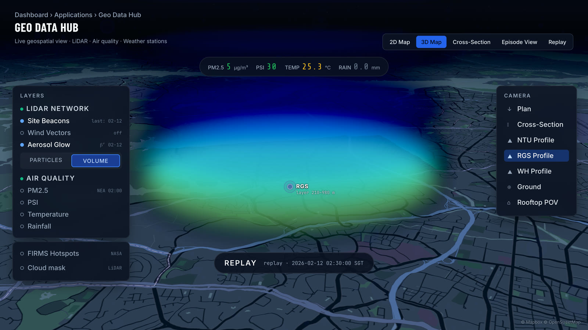

# 3DREAMS@SG

> Real-time atmospheric-intelligence platform that turns four raw sensor streams into a decision about whether anyone needs to act.

[](https://anthonymeijer.dev/projects/3dreams)
[](https://lidar-dashboard-3dreams.vercel.app)
[](https://anthonymeijer.dev)
[](tests/test_scorer.py)

<p align="center">
  <a href="https://anthonymeijer.dev/projects/3dreams"></a>
</p>
<p align="center"><sub>The Geo Data Hub on the 12 February 2026 replay, from the film. Map © Mapbox © OpenStreetMap.</sub></p>

## What it does

3DREAMS@SG watches the atmosphere over Singapore and decides when transported
aerosol is about to become a surface air-quality problem. It fuses Doppler-LiDAR
backscatter and wind, NEA air-quality readings, satellite fire detections, and a
cloud mask onto a single clock, across three sites, on a ten-minute cycle, then
scores every two-hour window and pushes anything that matters to a human over
Microsoft Teams.

The hard part is not ingesting the data. It is deciding, without a person in the
loop, whether a bright layer at one kilometre is transported smoke that will
reach the ground this afternoon, or a cloud base that means nothing at all.

## How it works

<!-- pipeline:start -->
<p align="center">
  <picture>
    <source media="(prefers-color-scheme: dark)" srcset="https://raw.githubusercontent.com/awvmeijer/3dreams-sg/main/assets/pipeline-dark.ba883f12.svg">
    <source media="(prefers-color-scheme: light)" srcset="https://raw.githubusercontent.com/awvmeijer/3dreams-sg/main/assets/pipeline-light.39b36244.svg">
    
  </picture>
</p>
<!-- pipeline:end -->

- **Ingest** four sources on four cadences: LiDAR profiles, NEA surface air
  quality, satellite fire detections, and a cloud mask
- **Fuse** onto one ten-minute clock across three sites, carrying gaps
  explicitly instead of interpolating over them
- **Record** every detected episode in a ledger that replay reads back
  through the same scorer
- **Score** each two-hour window through two detection stages: a six-component
  probability model with a diurnal boundary-layer breakthrough forecast, and a
  three-stage cloud classifier beside it
- **Act** through a Microsoft Teams agent that posts the alerts and answers 17
  commands, a Telegram bot for plots and status, a 10-panel mission-control
  dashboard, and a 5-viewport geospatial hub

The full write-up is in [docs/architecture.md](docs/architecture.md), including
why this extract makes the cloud check a gate rather than a seventh weighted
term, and why
the scorer is a pure function.

## Run it

No dependencies. Standard library only.

```bash
python3 examples/synthetic_window.py
```

Three synthetic windows: a real transport event, the identical aerosol layer
overnight, and a cloud pretending to be one. The middle case scores 1.00 on the
breakthrough term at 14:00 and 0.11 at 03:00, which is the diurnal term earning
its place. The third scores 0.80 overall and is still rejected, which is the
cloud gate earning its place.

```bash
python3 -m unittest discover -s tests
```

## Highlights

- **One scorer, three callers.** The live pipeline, the replay engine, and the
  dashboard call the same function. They agree by construction rather than by
  convention, which is only possible because the scorer takes a window and
  returns a score, with no clock reads and no I/O.
- **Every episode is replayable.** Detected episodes are recorded in a ledger,
  and changing the detection logic means rerunning history through the same
  scorer and diffing the verdicts before anything ships. A detector
  you cannot re-run against the past is a detector you cannot safely change.
- **Cloud is a gate, not a term.** A cloud base looks like dense transported
  aerosol to a backscatter-only test. As a weighted component it could be
  outvoted by a high transport score; as a gate it cannot. That is this
  extract's design. In production the three-stage cloud mask runs beside the
  score and its verdict goes on the alert card, in front of the operator.
- **Time of day is a first-class input.** Aloft is not the same as at the
  surface. The boundary layer has to grow past a layer before anyone breathes
  it, so the same profile means different things at 03:00 and 14:00.

## Stack

`Python` · `PostgreSQL` · `Next.js` · `TypeScript` · `Three.js` · `Deck.GL`

## Status and scope

This repository is a **public extract, not the production system**.

It contains the architecture and a standalone, runnable scorer over synthetic
data. It deliberately does not contain the production pipeline, any
observational data, any credentials, or the operational thresholds. The
coefficients in [`src/scorer.py`](src/scorer.py) are placeholders chosen to make
the synthetic example readable, and the structure is illustrative rather than a
line-by-line copy of the deployed scorer.

The live system runs at NTU's Centre for Climate Change and Environmental Health, which has operated it since handover in August 2026.

## About

Built by [Anthony Meijer](https://anthonymeijer.dev). Part of my work
on real-time ML systems and LLM agents.
