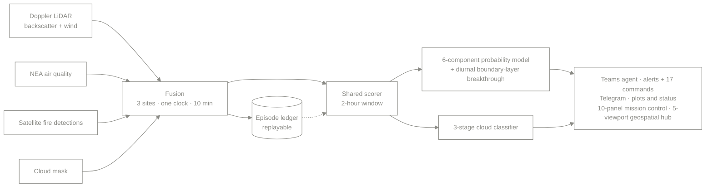

# Architecture

## The pipeline

## One clock

Four sources arrive on four different cadences, in four different coordinate
conventions, with four different ideas of what a timestamp means. Fusion is
mostly the unglamorous work of agreeing on a clock: resample everything onto a
ten-minute grid, carry the gaps explicitly rather than interpolating over them,
and refuse to score a window whose inputs do not overlap.

Interpolating across a gap is the tempting shortcut and the wrong one. A filled
gap is indistinguishable from data downstream, and the scorer would treat it as
evidence.

## One scorer, three callers

The scoring function is called by three things: the live pipeline, the replay
engine, and the dashboard. They share one implementation, not three that agree
by convention.

That constraint is what forces the scorer to be a pure function of a window. No
clock reads, no database handles, no configuration lookups at call time. If the
scorer could see the wall clock, replaying last month's data would produce
different answers than it did last month, and the episode ledger would be
fiction.

See [`src/scorer.py`](../src/scorer.py). The signature is `score(window) -> Score`
and that is the whole interface.

## Why two detection stages

The six-component model asks "does this look like transported aerosol?" The
cloud classifier asks "is this aerosol at all?"

They are separate because cloud is the dominant false-positive source and it
fails differently from every other error. A cloud base returns a strong, sharp
backscatter signal at a plausible height, which is precisely what a dense
transported layer looks like to a single-channel test. Folding cloud in as a
seventh weighted term would let a high transport score outvote it. In this
extract it is a gate, not a term.

The classifier runs three stages in order, cheapest first, and the first stage
to reject wins:

| Stage | Test | Catches |
| --- | --- | --- |
| 1 | gross opacity | saturating returns, obvious cloud |
| 2 | vertical structure | sharp edges that aerosol layers do not have |
| 3 | persistence | how much of the column sits near the peak |

Production differs in two ways. Its three stages are an onset test (a return
too strong, or an edge too sharp), a column test (the cloud's body above its
base and the attenuation shadow it casts), and a persistence test over
consecutive minutes. And the mask runs beside the six-component score rather
than gating it: its verdict travels on the alert card, so the operator sees
whether a layer could be cloud before acting on it.

## Why the diurnal term exists

Transported aerosol usually arrives aloft. It becomes a public-health question
only when the convective boundary layer grows past it and mixes it down, and
that growth is a strong function of time of day.

The consequence is that the same profile means different things at 03:00 and
14:00. A detector without a diurnal term either alerts overnight on something
nobody will breathe for nine hours, or stays quiet through the early-afternoon
window when it matters. `examples/synthetic_window.py` shows exactly this: an
identical aerosol layer scores 1.00 on the breakthrough term at 14:00 and 0.11
at 03:00.

## The episode ledger

Every detected episode is recorded in the ledger under a stable key, so a
replay updates its own record instead of adding a second one. Replay reads the
ledger back through the same scorer.

This is what makes a change to the detection logic auditable: rerun history,
diff the verdicts, and see exactly which episodes changed and why, before the
change goes near production.

## Scope of this repository

This repository is a public extract. It carries the architecture and a
standalone, runnable scorer over synthetic data. The production system, its
data, its credentials, and its operational thresholds are not here and will not
be. Coefficients in `src/scorer.py` are placeholders chosen for readability.
